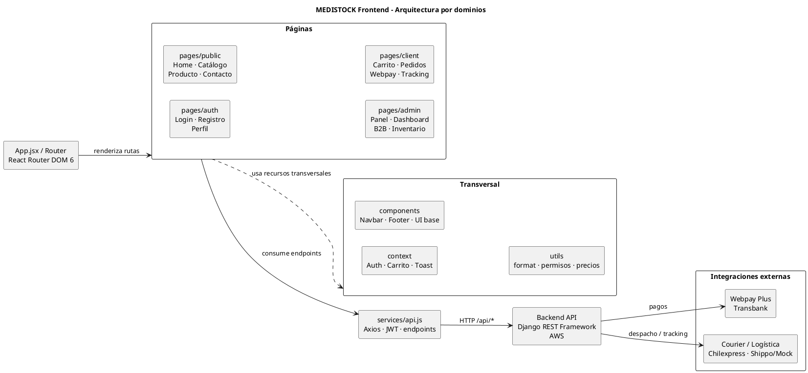

# Documentación Frontend MEDISTOCK

**Proyecto:** MEDISTOCK
**Aplicación:** Frontend React/Vite
**Última actualización:** 2026-05-29
**Responsable:** Equipo frontend MEDISTOCK
**Estado del documento:** Vigente para revisión técnica y académica

# NOTA
## Nota de actualización para versión individual

Esta documentación proviene de una versión anterior y más completa de MEDISTOCK.  
La versión actual del proyecto es una implementación individual y reducida para la asignatura Integración de Plataformas.

No todos los endpoints documentados están implementados actualmente en el backend individual.

### Estado real actual confirmado

Backend desplegado en Railway con Django REST Framework y MySQL Railway.

Endpoints confirmados funcionando:

- `GET /api/inventory/catalogo/`
- `GET /api/inventory/public/categorias/`
- `GET /api/inventory/public/productos/<codigo>/`
- `POST /api/accounts/login/`
- `POST /api/accounts/login/refresh/`
- `GET /api/accounts/perfil/me/`
- `POST /api/accounts/logout/`

Frontend confirmado funcionando:

- Home carga productos desde Railway.
- Catálogo carga productos desde Railway.
- Categorías públicas cargan desde Railway.
- CORS está configurado correctamente.
- El frontend local usa el backend remoto Railway.

### Advertencia para desarrollo

Antes de modificar una pantalla o servicio, verificar si el endpoint existe realmente en el backend actual.

Si una pantalla consume endpoints heredados que aún no existen, no crear todos los endpoints de golpe.  
Primero decidir si corresponde:

1. Adaptar el frontend al backend actual.
2. Crear un endpoint mínimo.
3. Marcar la pantalla como demo controlado.
4. Posponer la funcionalidad.

No modificar configuración de Railway, MySQL, CORS, `ALLOWED_HOSTS`, `wsgi.py`, `gunicorn` ni comandos de despliegue si la tarea es solo frontend.

# FIN NOTA

## Tabla de contenidos

1. [Visión general](#visión-general)
2. [Stack tecnológico real](#stack-tecnológico-real)
3. [Estructura de carpetas](#estructura-de-carpetas)
4. [Diagrama PlantUML de arquitectura](#diagrama-plantuml-de-arquitectura)
5. [Sistema de diseño y UI](#sistema-de-diseño-y-ui)
6. [Mapa de endpoints consumidos](#mapa-de-endpoints-consumidos)
7. [Vistas por tipo de usuario](#vistas-por-tipo-de-usuario)
8. [Documentación por página o flujo](#documentación-por-página-o-flujo)
9. [Autenticación y sesión](#autenticación-y-sesión)
10. [Carrito, checkout y permisos](#carrito-checkout-y-permisos)
11. [Precios e IVA](#precios-e-iva)
12. [Inventario y administración](#inventario-y-administración)
13. [Manejo de errores](#manejo-de-errores)
14. [Responsividad y ajustes visuales](#responsividad-y-ajustes-visuales)
15. [Pruebas realizadas y recomendadas](#pruebas-realizadas-y-recomendadas)
16. [Pendientes técnicos](#pendientes-técnicos)
17. [Changelog](#changelog)

## Visión general

El frontend de MEDISTOCK es una aplicación web construida con React y Vite para venta, seguimiento y gestión operativa de insumos médicos. La aplicación consume un backend Django REST Framework mediante un cliente HTTP centralizado en `src/services/api.js`.

La experiencia está separada en tres ámbitos:

- **Experiencia pública:** Home ecommerce, catálogo, detalle de producto y contacto. Permite explorar productos sin iniciar sesión.
- **Experiencia cliente B2C/B2B:** Login, registro, carrito, confirmación de pedido, cotización logística, Webpay, mis pedidos y tracking.
- **Panel interno:** Dashboard, aprobaciones B2B, inventario, productos, trabajadores, conciliación de pagos, traslados e integraciones demo/controladas.

La arquitectura actual mantiene React como capa de presentación, `Context API` como estado compartido principal y Axios como cliente para comunicarse con el backend.

## Stack tecnológico real

Según `package.json`, el stack real del frontend es:

| Tecnología | Uso |
| --- | --- |
| React 18 | Construcción de componentes y vistas |
| Vite 5 | Dev server, build y empaquetado |
| React Router DOM 6 | Rutas públicas, protegidas y flujos por rol |
| Axios | Cliente HTTP hacia la API Django |
| Downshift | Combobox/selectores con búsqueda en registro y perfil |
| Recharts | Gráficos del dashboard analista |
| Context API | Auth, carrito y notificaciones |
| CSS por página/componente | Estilos sin framework visual externo |

Scripts npm disponibles:

| Comando | Descripción |
| --- | --- |
| `npm run dev` | Levanta Vite en modo desarrollo |
| `npm run build` | Genera build de producción |
| `npm run preview` | Previsualiza el build generado |

## Estructura de carpetas

Estructura real después del ordenamiento por dominios:

```text
src/
  App.jsx
  main.jsx
  index.css
  components/
    Footer.jsx
    Footer.css
    Navbar.jsx
    Navbar.css
    ToastViewport.jsx
    ToastViewport.css
    ui/
      Badge.jsx
      Button.jsx
      Card.jsx
      Card.css
      DataTable.jsx
      EmptyState.jsx
      EmptyState.css
      Spinner.jsx
      index.js
  context/
    AuthContext.jsx
    CarritoContext.jsx
    ToastContext.jsx
  pages/
    public/
      HomePage.jsx
      HomePage.css
      CatalogoPage.jsx
      CatalogoPage.css
      ProductoDetallePage.jsx
      ProductoDetallePage.css
      ContactoPage.jsx
      ContactoPage.css
    auth/
      LoginPage.jsx
      LoginPage.css
      RegistroPage.jsx
      RegistroPage.css
      PerfilPage.jsx
      PerfilPage.css
    client/
      CarritoPage.jsx
      CarritoPage.css
      ConfirmacionPedidoPage.jsx
      ConfirmacionPedidoPage.css
      ResultadoPagoPage.jsx
      ResultadoPagoPage.css
      WebpayResultadoPage.jsx
      WebpayResultadoPage.css
      TrackingPage.jsx
      TrackingPage.css
      PedidoDetallePage.jsx
      PedidoDetallePage.css
      ComprobanteDtePage.jsx
      ComprobanteDtePage.css
    admin/
      PanelPage.jsx
      PanelPage.css
      DashboardAnalistaPage.jsx
      DashboardAnalistaPage.css
      AprobacionesB2BPage.jsx
      AprobacionesB2BPage.css
      AdminProductosPage.jsx
      AdminProductosPage.css
      AdminTrabajadoresPage.jsx
      AdminTrabajadoresPage.css
      ComprasProveedorPage.jsx
      ComprasProveedorPage.css
      ConciliacionPagosPage.jsx
      ConciliacionPagosPage.css
      ConveniosInstitucionalesPage.jsx
      ConveniosInstitucionalesPage.css
      GuiasDespachoPage.jsx
      GuiasDespachoPage.css
      IntegracionesPage.jsx
      IntegracionesPage.css
      TrasladosInventarioPage.jsx
      TrasladosInventarioPage.css
  services/
    api.js
  utils/
    catalogoEnriquecido.js
    cotizacionStorage.js
    format.js
    gruposCatalogo.js
    permisos.js
  docs/
    frontend-structure.puml
```

Responsabilidades:

| Carpeta | Responsabilidad |
| --- | --- |
| `components/` | Navbar, Footer, toasts y componentes UI reutilizables |
| `context/` | Estado global de autenticación, carrito y notificaciones |
| `pages/public/` | Páginas públicas o de exploración |
| `pages/auth/` | Login, registro y perfil |
| `pages/client/` | Compra, pago, pedidos y tracking |
| `pages/admin/` | Panel interno y módulos administrativos |
| `services/` | Cliente API centralizado, interceptores y normalización |
| `utils/` | Formato, permisos, precios y helpers |
| `docs/` | Diagramas y documentación técnica complementaria |

## Diagrama PlantUML de arquitectura

El archivo fuente del diagrama está en `docs/frontend-structure.puml`.

El diagrama representa la arquitectura frontend actual:

- `App.jsx / Router` solo renderiza páginas mediante React Router DOM.
- Las páginas usan recursos transversales como contextos, componentes y utilidades.
- Las páginas consumen endpoints a través de `services/api.js`.
- `services/api.js` consume el backend Django REST Framework.
- Webpay y Courier se integran desde el backend, no directamente desde el frontend.



## Sistema de diseño y UI

MEDISTOCK no usa una librería externa de diseño como Material UI, Bootstrap o Ant Design. La interfaz se construye con CSS propio por página y componentes UI internos.

Elementos visuales reales:

| Elemento | Implementación actual |
| --- | --- |
| Navbar | `components/Navbar.jsx` y `Navbar.css`; contiene navegación, usuario y carrito |
| Footer | `components/Footer.jsx` y `Footer.css`; bloque azul oscuro reutilizado en Home y Catálogo |
| Cards | Usadas en productos, promociones, panel, dashboard y módulos admin |
| Badges | Estados de stock, demo/controlado, disponibilidad y estados operativos |
| Alertas | Mensajes de error, éxito y reglas de negocio, por ejemplo aprobaciones B2B |
| Botones | Estilos propios como primarios, secundarios y outline |
| Tablas | Listados de productos, trabajadores, aprobaciones, pagos e inventario |
| Formularios | Registro, perfil, confirmación de pedido, productos y trabajadores |
| Gráficos | Recharts en Dashboard Analista |

La UI prioriza legibilidad, estructura de panel administrativo, cards con bordes suaves, estados vacíos claros y feedback visible para errores del backend.

## Mapa de endpoints consumidos

Todos los endpoints se consumen desde `src/services/api.js`, que configura Axios, JWT, refresh token y normalización de respuestas.

### Auth/cuentas

| Método | Endpoint | Uso frontend | Pantalla o flujo |
| --- | --- | --- | --- |
| POST | `/api/accounts/login/` | Inicio de sesión | Login |
| POST | `/api/accounts/logout/` | Cierre de sesión | Navbar/AuthContext |
| POST | `/api/accounts/login/refresh/` | Renovar access token | Interceptor Axios |
| GET | `/api/accounts/perfil/me/` | Obtener perfil autenticado | Perfil/AuthContext |
| PATCH | `/api/accounts/perfil/me/` | Actualizar perfil | Perfil |
| POST | `/api/accounts/registro/cliente/` | Registro de cliente | Registro |
| GET | `/api/accounts/mis-direcciones/` | Direcciones del usuario | Checkout/perfil si aplica |
| POST | `/api/accounts/mis-direcciones/` | Crear dirección alternativa | Confirmación de pedido, solo cliente |

### Catálogo/inventario

| Método | Endpoint | Uso frontend | Pantalla o flujo |
| --- | --- | --- | --- |
| GET | `/api/inventory/catalogo/` | Productos públicos normalizados | Home, Catálogo |
| GET | `/api/inventory/public/productos/<id>/` | Detalle público de producto | Detalle producto |
| GET | `/api/inventory/public/categorias/` | Categorías públicas | Catálogo |
| GET | `/api/inventory/productos/` | Listado admin de productos | Admin productos |
| POST | `/api/inventory/productos/` | Crear producto simple | Admin productos |
| POST | `/api/inventory/ingresar-producto/` | Crear producto con lote, inventario y movimiento | Admin productos |
| GET | `/api/inventory/categorias/` | Select de categorías admin | Admin productos |
| GET | `/api/inventory/marcas/` | Select de marcas admin | Admin productos |
| GET | `/api/inventory/inventarios/` | Resumen inventario real | Panel/Dashboard |
| GET | `/api/inventory/lotes/` | Lotes disponibles | Panel/Dashboard |
| GET | `/api/inventory/movimientos/` | Movimientos de inventario | Panel/Dashboard |
| GET | `/api/inventory/traslados/` | Listado de traslados reales | Traslados inventario |

### Pedidos

| Método | Endpoint | Uso frontend | Pantalla o flujo |
| --- | --- | --- | --- |
| POST | `/api/orders/pedidos/` | Crear pedido | Confirmación pedido |
| GET | `/api/orders/pedidos/mis-pedidos/` | Pedidos del usuario | Panel cliente/Pedido detalle |
| GET | `/api/orders/pedidos/todos/` | Pedidos administrativos | Panel, Dashboard, Aprobaciones B2B |
| GET | `/api/orders/pedidos/<id>/` | Detalle de pedido | Pedido detalle, Tracking |
| POST | `/api/orders/pedidos/<id>/aprobar/` | Aprobar/rechazar pedido B2B | Aprobaciones B2B |

### Pagos

| Método | Endpoint | Uso frontend | Pantalla o flujo |
| --- | --- | --- | --- |
| POST | `/api/payments/webpay/iniciar/` | Iniciar pago Webpay | Resultado pago/checkout |
| GET | `/api/payments/webpay/commit/` | Confirmar retorno Webpay | WebpayResultado |
| GET | `/api/payments/webpay/estado/<token_ws>/` | Consultar estado Webpay | WebpayResultado |
| GET | `/api/payments/mis-pagos/` | Pagos reales si el rol tiene permiso | Conciliación pagos/Dashboard |

### Logística/ubicaciones

| Método | Endpoint | Uso frontend | Pantalla o flujo |
| --- | --- | --- | --- |
| POST | `/api/logistics/cotizar/` | Cotizar despacho | Confirmación pedido |
| GET | `/api/logistics/envios/<pedido_id>/tracking/` | Tracking por pedido | Tracking |
| POST | `/api/logistics/courier/generar/` | Generación courier desde backend | Flujo logístico si aplica |
| GET | `/api/logistics/courier/tracking/<numero>/` | Tracking courier desde backend | Tracking si hay número courier |
| GET | `/api/locations/regions/` | Regiones | Registro, Perfil, Checkout |
| GET | `/api/locations/comunas/` | Comunas por región | Registro, Perfil, Checkout |
| GET | `/api/locations/sucursales/<id>/` | Sucursal por ID | Confirmación pedido/Admin productos |

### Admin/trabajadores

| Método | Endpoint | Uso frontend | Pantalla o flujo |
| --- | --- | --- | --- |
| POST | `/api/accounts/registro/trabajador/` | Crear trabajador | Admin trabajadores |
| GET | `/api/accounts/trabajadores/` | Listar trabajadores | Admin trabajadores |
| PATCH | `/api/accounts/trabajadores/<id>/` | Actualizar/desactivar trabajador si backend lo permite | Admin trabajadores |

### Demos controlados

Una pantalla marcada como **demo controlado** muestra información local o estructura funcional sin persistencia real completa. Esto se usa para defender el flujo futuro sin disparar 404 contra endpoints inexistentes. Ejemplos actuales: algunos datos de compras proveedor, convenios institucionales, integraciones y documentos tributarios.

## Vistas por tipo de usuario

### Visitante

Puede acceder a:

- Home.
- Contacto.
- Catálogo.
- Detalle de producto.
- Login y registro.

No puede crear pedidos ni acceder al panel protegido.

### Cliente B2C/B2B

Puede acceder a:

- Catálogo y detalle.
- Carrito.
- Confirmación de pedido.
- Cotización de despacho.
- Pago Webpay.
- Mis pedidos, detalle y tracking.
- Perfil.

El flujo de compra usa precios consistentes con IVA cuando el backend entrega `precio_con_iva`.

### Admin/trabajador

Puede acceder al panel interno según rol y permisos. Puede revisar productos, trabajadores, dashboard, inventario, aprobaciones B2B, pagos y módulos operativos.

No puede completar checkout como cliente. El frontend bloquea carrito/confirmación para evitar que llegue al error backend: “Solo los clientes pueden registrar direcciones de entrega.”

## Documentación por página o flujo

### Home

- **Ruta:** `/`
- **Tipo de usuario:** visitante, cliente, trabajador/admin.
- **Propósito:** presentar MEDISTOCK como ecommerce médico y mostrar productos destacados, categorías visuales y promociones.
- **Datos:** productos reales desde catálogo.
- **Endpoints:** `GET /api/inventory/catalogo/`.
- **Acciones:** navegar a catálogo, detalle, carrito y panel.
- **Errores:** muestra estado de carga, error de catálogo o estado vacío.
- **Navegación relacionada:** catálogo, producto, registro, carrito, panel.

### Catálogo

- **Ruta:** `/catalogo`
- **Tipo de usuario:** público y autenticado.
- **Propósito:** listar productos del backend con filtros visuales/búsqueda.
- **Datos:** productos, categorías, precio y stock.
- **Endpoints:** `GET /api/inventory/catalogo/`, `GET /api/inventory/public/categorias/`.
- **Acciones:** ver detalle y agregar al carrito si el usuario puede comprar.
- **Errores:** carga, error de backend, estado vacío y botones deshabilitados si no corresponde comprar.
- **Navegación relacionada:** detalle, carrito.

### Detalle de producto

- **Ruta:** `/producto/:codigo`
- **Tipo de usuario:** público y autenticado.
- **Propósito:** mostrar información detallada del producto.
- **Datos:** nombre, descripción, precio, stock y disponibilidad.
- **Endpoints:** `GET /api/inventory/public/productos/<id>/`; fallback compatible con catálogo si corresponde.
- **Acciones:** agregar al carrito, volver a catálogo, revisar stock por sucursal si está disponible.
- **Errores:** producto no encontrado, error de backend o stock no disponible.
- **Navegación relacionada:** catálogo, carrito.

### Login

- **Ruta:** `/login`
- **Tipo de usuario:** visitante.
- **Propósito:** autenticar usuario con backend.
- **Datos:** email/username y contraseña.
- **Endpoints:** `POST /api/accounts/login/`.
- **Acciones:** iniciar sesión y redirigir.
- **Errores:** credenciales inválidas, backend no disponible y errores de autenticación.
- **Navegación relacionada:** registro, panel o home según sesión.

### Registro

- **Ruta:** `/registro`
- **Tipo de usuario:** visitante.
- **Propósito:** crear cuenta cliente.
- **Datos:** datos personales, ubicación y credenciales.
- **Endpoints:** `POST /api/accounts/registro/cliente/`, `GET /api/locations/regions/`, `GET /api/locations/comunas/`.
- **Acciones:** registrar cliente.
- **Errores:** validaciones frontend y mensajes del backend.
- **Navegación relacionada:** login.

### Perfil

- **Ruta:** `/perfil`
- **Tipo de usuario:** autenticado.
- **Propósito:** mostrar y actualizar datos del usuario.
- **Datos:** usuario, perfil, ubicación.
- **Endpoints:** `GET/PATCH /api/accounts/perfil/me/`, regiones y comunas.
- **Acciones:** actualizar información.
- **Errores:** si `/perfil/me/` responde 404, se muestra perfil incompleto sin cerrar sesión.
- **Navegación relacionada:** panel, catálogo.

### Carrito

- **Ruta:** `/carrito`
- **Tipo de usuario:** cliente comprador.
- **Propósito:** revisar productos antes de confirmar pedido.
- **Datos:** items desde `CarritoContext`, cantidades y precios.
- **Endpoints:** no crea datos por sí solo.
- **Acciones:** ajustar cantidades, eliminar productos, avanzar a confirmación.
- **Errores:** estado vacío, usuario sin permiso de compra, stock no disponible.
- **Navegación relacionada:** catálogo, confirmación pedido.

### Confirmación de pedido

- **Ruta:** `/confirmar-pedido`
- **Tipo de usuario:** cliente comprador.
- **Propósito:** preparar dirección, cotización logística y creación de pedido.
- **Datos:** carrito, usuario, dirección, cotización y totales.
- **Endpoints:** `POST /api/logistics/cotizar/`, `POST /api/orders/pedidos/`, `POST /api/accounts/mis-direcciones/`.
- **Acciones:** cotizar despacho, crear pedido e iniciar pago.
- **Errores:** bloqueo para no clientes, dirección incompleta, error de cotización, error de pedido.
- **Navegación relacionada:** carrito, resultado pago.

### Resultado/Webpay

- **Rutas:** `/resultado-pago/:pedidoId`, `/resultado-pago`, `/webpay/resultado`
- **Tipo de usuario:** cliente; retorno Webpay puede llegar sin sesión activa.
- **Propósito:** iniciar o confirmar pago Webpay y mostrar estado.
- **Datos:** pedido, token Webpay, estado de pago.
- **Endpoints:** `POST /api/payments/webpay/iniciar/`, `GET /api/payments/webpay/commit/`, `GET /api/payments/webpay/estado/<token_ws>/`.
- **Acciones:** redirigir a Webpay, confirmar resultado, volver a pedidos/tracking.
- **Errores:** token inválido, pago rechazado/anulado, backend no disponible.
- **Navegación relacionada:** pedidos, tracking.

### Tracking

- **Ruta:** `/tracking/:despachoId`
- **Tipo de usuario:** autenticado.
- **Propósito:** mostrar seguimiento del pedido/envío.
- **Datos:** pedido y eventos de tracking.
- **Endpoints:** `GET /api/orders/pedidos/<id>/`, `GET /api/logistics/envios/<pedido_id>/tracking/`.
- **Acciones:** consultar estado y volver a detalle/panel.
- **Errores:** tracking no encontrado, pedido no encontrado, error de backend.
- **Navegación relacionada:** pedido detalle, panel.

### Panel

- **Ruta:** `/panel`
- **Tipo de usuario:** autenticado.
- **Propósito:** entrada principal para cliente o usuario interno.
- **Datos:** pedidos, resumen inventario y accesos según rol.
- **Endpoints:** pedidos propios/todos e inventario según permisos.
- **Acciones:** navegar a módulos internos o pedidos.
- **Errores:** permisos insuficientes, datos no disponibles.
- **Navegación relacionada:** dashboard, aprobaciones, inventario, productos, trabajadores.

### Admin productos

- **Ruta:** `/admin/productos`
- **Tipo de usuario:** admin/trabajador con permiso.
- **Propósito:** gestionar productos desde frontend sin Django Admin.
- **Datos:** productos, categorías y marcas.
- **Endpoints:** `GET/POST /api/inventory/productos/`, `POST /api/inventory/ingresar-producto/`, categorías y marcas.
- **Acciones:** crear producto simple o producto con stock inicial.
- **Errores:** validaciones frontend, errores del serializer, sucursal/categoría inexistente.
- **Navegación relacionada:** catálogo, panel.

### Admin trabajadores

- **Ruta:** `/admin/trabajadores`
- **Tipo de usuario:** admin.
- **Propósito:** crear y listar trabajadores.
- **Datos:** trabajadores existentes y formulario de creación.
- **Endpoints:** `POST /api/accounts/registro/trabajador/`, `GET/PATCH /api/accounts/trabajadores/`.
- **Acciones:** crear trabajador, asignar cargo/rol operativo, desactivar si backend lo permite.
- **Errores:** email duplicado, rol inválido, permisos insuficientes.
- **Navegación relacionada:** panel.

### Aprobaciones B2B

- **Ruta:** `/panel/aprobaciones-b2b`
- **Tipo de usuario:** admin/trabajador autorizado.
- **Propósito:** revisar y aprobar/rechazar pedidos institucionales.
- **Datos:** pedidos reales desde backend.
- **Endpoints:** `GET /api/orders/pedidos/todos/`, `POST /api/orders/pedidos/<id>/aprobar/`.
- **Acciones:** aprobar, rechazar u observar según estado.
- **Errores:** muestra mensajes reales del backend, incluyendo 409 de stock/reserva insuficiente.
- **Navegación relacionada:** panel, detalle pedido.

### Dashboard analista

- **Ruta:** `/panel/dashboard-analista`
- **Tipo de usuario:** admin/analista/trabajador autorizado.
- **Propósito:** mostrar métricas reales de pedidos, ventas e inventario.
- **Datos:** pedidos, inventarios, lotes, movimientos y pagos si hay permisos.
- **Endpoints:** pedidos todos, inventarios, lotes, movimientos, pagos.
- **Acciones:** revisar métricas y gráfico de ventas por mes.
- **Errores:** 403 con mensaje de permisos, estados vacíos si no hay datos.
- **Navegación relacionada:** panel, aprobaciones, inventario.

## Autenticación y sesión

El login se realiza contra `POST /api/accounts/login/`. Cuando el backend responde correctamente, el frontend guarda en `localStorage`:

- Access token.
- Refresh token.
- Datos mínimos del usuario.

`AuthContext.jsx` recupera esa información al montar la aplicación para mantener la sesión tras F5. El interceptor de Axios en `services/api.js` lee el access token desde `localStorage` en cada request y agrega `Authorization: Bearer <token>`.

Si una request responde 401, el interceptor intenta renovar el access token con `/api/accounts/login/refresh/` siempre que exista refresh token. Si el refresh falla, se limpia la sesión.

Caso especial: `/api/accounts/perfil/me/` puede responder 404 cuando el usuario no tiene `PerfilCliente` o `PerfilTrabajador`. Ese 404 no debe cerrar sesión si el frontend ya tiene datos mínimos del login. En ese caso se muestra perfil incompleto o se conserva la sesión.

## Carrito, checkout y permisos

El carrito está centralizado en `CarritoContext.jsx`.

Reglas actuales:

- Solo usuarios cliente pueden comprar.
- Admin/trabajador no pueden completar checkout.
- El frontend bloquea el flujo antes de intentar crear dirección alternativa o pedido.
- La dirección alternativa se crea solo para clientes.
- La cotización logística usa `/api/logistics/cotizar/`.
- La creación de pedido usa `/api/orders/pedidos/`.
- El inicio de Webpay usa `/api/payments/webpay/iniciar/`.

El bloqueo para usuarios no cliente evita una mala experiencia ante respuestas 403 legítimas del backend.

## Precios e IVA

El backend entrega `precio_con_iva` en productos/catálogo cuando está disponible. El frontend lo usa como precio principal visible y no recalcula IVA.

Prioridad de precio:

1. `precio_con_iva`
2. `precio_b2c`
3. `precio_b2b`
4. `valor_unitario`
5. `precio`

Pantallas donde se aplica:

- Catálogo.
- Detalle de producto.
- Carrito.
- Confirmación de pedido.

Esto evita inconsistencias entre precio mostrado, precio agregado al carrito y total confirmado.

## Inventario y administración

### Gestión de productos

La pantalla `AdminProductosPage.jsx` permite crear productos desde el frontend.

Modalidades:

- **Producto simple:** usa `POST /api/inventory/productos/`.
- **Producto con stock inicial:** usa `POST /api/inventory/ingresar-producto/`.

El endpoint `/api/inventory/ingresar-producto/` permite crear o recuperar producto por SKU, asociar categorías, crear o recuperar lote, actualizar inventario y registrar movimiento de entrada.

### Gestión de trabajadores

La pantalla `AdminTrabajadoresPage.jsx` permite registrar trabajadores con rol/cargo operativo.

El formulario muestra email como dato de acceso. Internamente envía `usuario.username = usuario.email` para compatibilidad con el serializer backend actual.

Endpoints:

- `POST /api/accounts/registro/trabajador/`.
- `GET/PATCH /api/accounts/trabajadores/`.

## Manejo de errores

| Código | Manejo frontend |
| --- | --- |
| 400 | Se muestran validaciones o mensajes del backend |
| 401 | Se intenta refresh; si falla, logout |
| 403 | Mensaje “No tienes permisos para consultar esta información” o bloqueo de flujo |
| 404 | Mensaje de información no encontrada; en perfil no fuerza logout automáticamente |
| 409 | Se muestra mensaje real del backend |
| 500 | Mensaje de error del servidor |
| Red/backend apagado | Mensaje de imposibilidad de conexión |

Ejemplo de bloqueo por rol:

> El flujo de compra solo está disponible para clientes. Usa una cuenta cliente para realizar pedidos.

Ejemplo de aprobación B2B con stock insuficiente:

> Reserva insuficiente para lote id=25. Reservado: 0, requerido: 1.

## Responsividad y ajustes visuales

Ajustes visuales vigentes:

- Home con hero carrusel, productos destacados, categorías visuales, promociones y footer.
- Cards de productos destacados alineadas con `flex-direction: column`, imagen fija y footer anclado.
- Cards de promociones visuales alineadas con imagen, precio y botón estables.
- Catálogo con cards uniformes, badges de stock y botones claros.
- Footer azul oscuro con contraste alto.
- Paneles administrativos con cards, tablas y alertas.
- Formularios administrativos con CSS Grid responsive.
- Dashboard con tarjetas de métricas y gráfico Recharts responsive.

## Pruebas realizadas y recomendadas

Pruebas técnicas:

- `npm run build`.
- `git diff --check`.

Pruebas manuales recomendadas:

- Login y persistencia tras F5.
- Catálogo y detalle de producto.
- Carrito con precios con IVA.
- Bloqueo de checkout para admin/trabajador.
- Flujo cliente completo: catálogo, carrito, despacho, pedido, Webpay y tracking.
- Panel admin productos.
- Panel admin trabajadores.
- Aprobaciones B2B con pedido aprobable y con error 409.
- Dashboard analista con 0, 1 y varios meses de ventas.

## Pendientes técnicos

- Separar `services/api.js` por dominio: auth, inventory, orders, payments, logistics.
- Revisar permisos backend del registro de trabajador si sigue usando `AllowAny`.
- Revisar y reducir demos controlados cuando existan endpoints reales equivalentes.
- Evaluar code splitting por warning de bundle grande en Vite.
- Revisar fallback SPA en hosting para refrescar rutas internas.
- Probar flujo completo en ambiente limpio.
- Revisar migración de `producto.imagen` en bases de datos antiguas.
- Confirmar roles backend definitivos contra rutas protegidas frontend.

## Changelog

Cambios recientes documentados:

- Reordenamiento de carpetas por dominio: `public`, `auth`, `client`, `admin`.
- Creación de diagrama PlantUML de arquitectura frontend.
- Actualización de documentación frontend formal.
- Persistencia de sesión tras F5.
- Tolerancia al 404 de `/api/accounts/perfil/me/`.
- Uso de `precio_con_iva` como precio principal.
- Bloqueo de checkout para usuarios no cliente.
- Panel administrativo de productos.
- Producto simple y producto con stock inicial.
- Integración de `/api/inventory/ingresar-producto/`.
- Panel administrativo de trabajadores.
- Uso interno de `username = email` al crear trabajadores.
- Aprobaciones B2B conectadas a pedidos reales.
- Visualización de errores 409 reales del backend.
- Dashboard analista con métricas reales y gráfico Recharts.
- Cards de productos destacados alineadas.
- Cards de promociones visuales alineadas.
- Footer reutilizable y actualizado visualmente.
